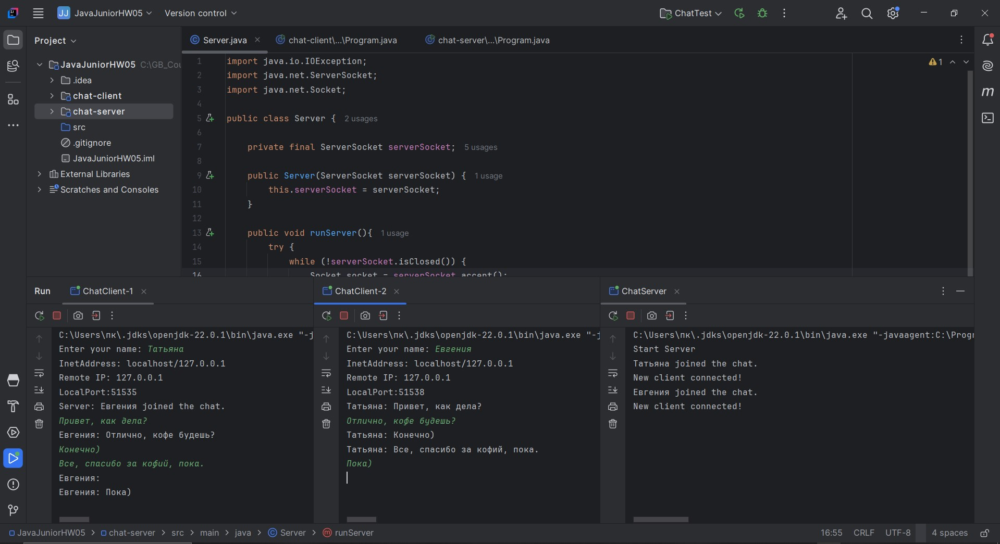
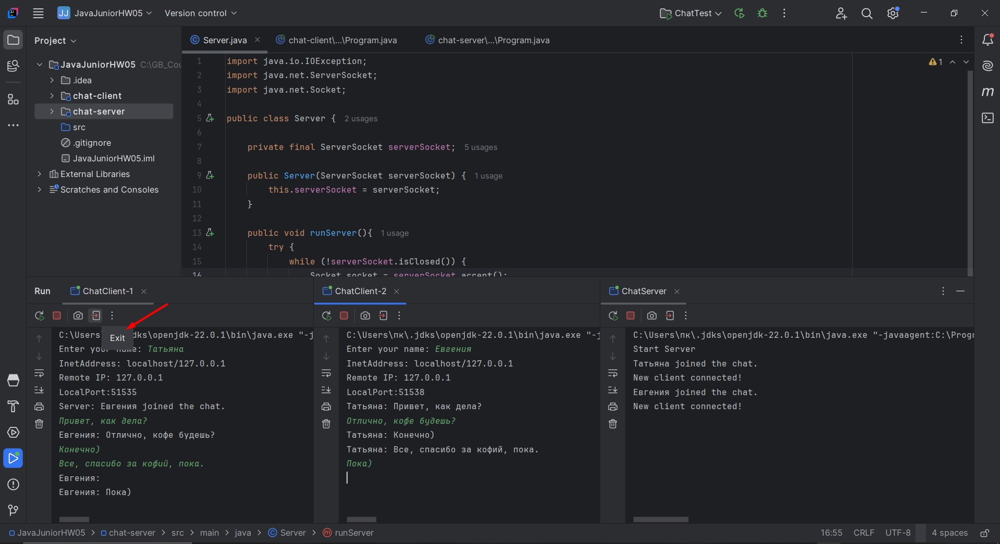
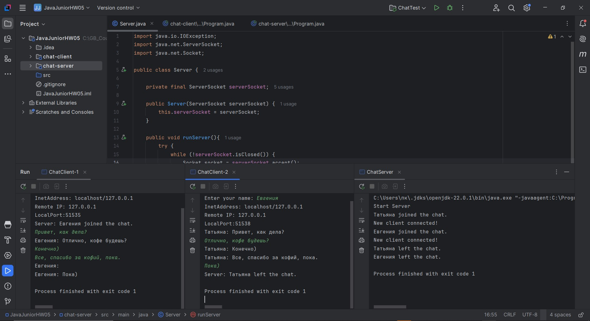

# Урок 5. Клиент/Сервер своими руками

Задание: 
Разработайте простой чат на основе сокетов. Ваше приложение должно включать в себя сервер, 
который принимает сообщения от клиентов и пересылает их всем участникам чата.

====================================================================================

## Демонстрация решения:

